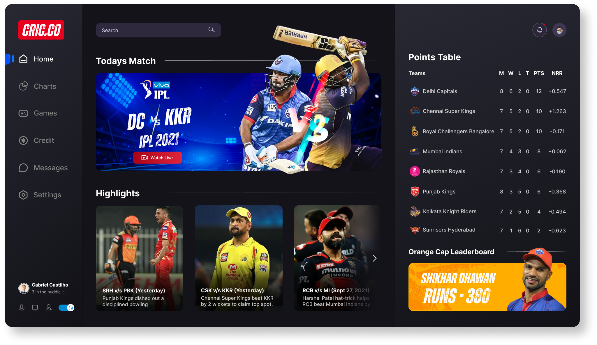

# CRIC.CO 🎮
This repository refers to a news site referring to the sport Cricket made with react 🚀 <br />

<p align="center" t>
  
</p>


# About 🔥

<p align="center" t>
  
</p>

This project was designed to address and practice advanced React concepts such as component-driven development, unit tests, e2e tests, and Chakra-UI.

To do this, this project uses Next.js as the main structure and aims to 
Tackle cricket sport news and display the IPL championship table score.

# Tecnologies 🚀
Next.js <br />
React <br />
Chakra-UI <br />
Axios <br />
Typescript <br />
Jest <br />
React Testing Library <br />

# Tests 🧪
To run all tests, you can run <code>yarn test</code>.

# How to contribute? 😍
**Fork this repository**
```bash
# Clone your fork
$ git clone your-fork-url && cd CRIC.CO
# Create a branch with your feature or bug fix
$ git checkout -b my-branch
# Commit your changes
$ git commit -m 'my changes'
# Push your branch
$ git push origin my-branch
```

Delete your branch, if you want, when your pull request merge. <br />

Made with 💜 by <a href="https://www.linkedin.com/in/gabrielcastilhov" target="_blank"> Gabriel Castilho 👋🏽 </a>. <br />
<br />